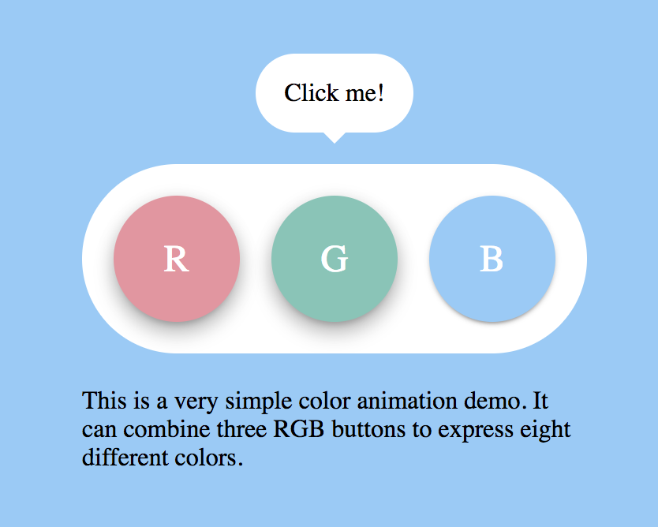

# 3bit RGB color animation

This is a very simple color animation demo. It can combine three RGB buttons to express eight different colors.

## LICENSE

All source code is available jointly under the MIT License and the Beerware License. Please see
[LICENSE.md](LICENSE.md) for details.

## Demo

To see the color animation, clone the repo or click a link below.

[Demo](https://hodalab.com/works/3bit-rgb-color-animation)

## Requirements

This requires the following to run:

- jQuery
- jQuery color animation

## Author

[Hodaka Sakamoto](https://hodalog.com/)
